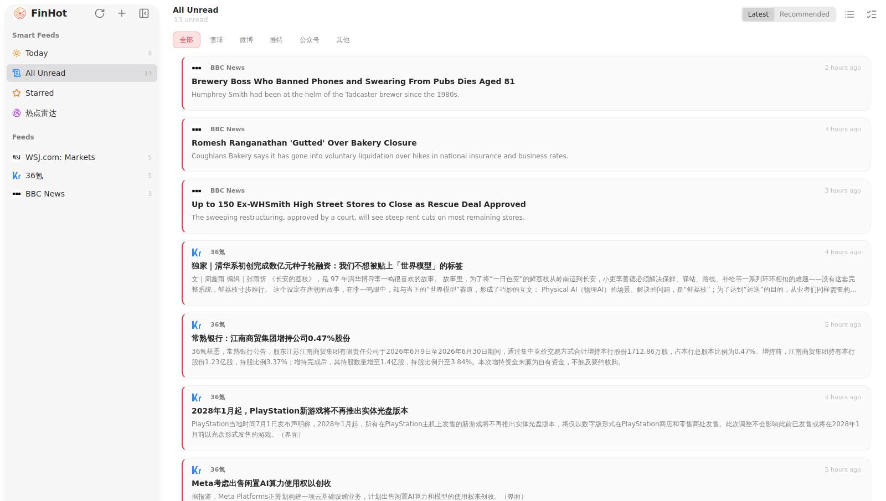
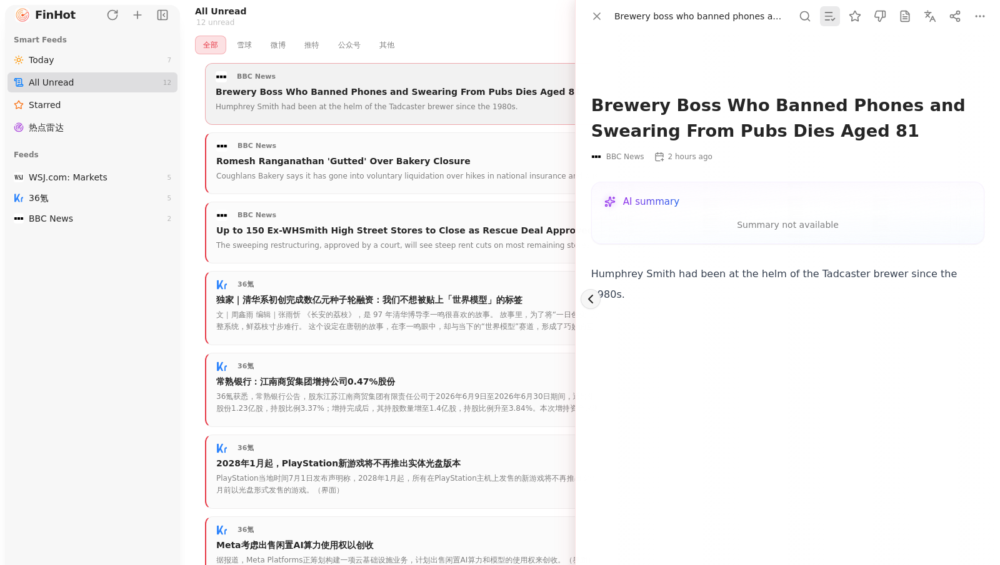

<div align="center">

**中文** · [English](./README.en.md)

  <h1>📰 FinHot · 金融信息流阅读器</h1>
  <p><strong>本地优先的金融 RSS 阅读器</strong></p>
  <p>聚合财经 RSS、微博、雪球、X，自动打分、摘要与中译，专注高效阅读</p>
</div>

<p align="center">
  
  
</p>

<p align="center">
  
</p>

---

## 它是什么

FinHot 基于 [Focal](https://github.com/nextcaicai/Focal)（[Folo/RSSNext](https://github.com/RSSNext/Folo) 的 fork）构建，复用其成熟的 RSS 订阅引擎、本地 SQLite 数据库、BYOK AI 增强框架和 Electron 桌面壳，是一个**面向金融场景的信息流阅读器**：

- 📡 **多源聚合** — RSS 财经源 + 微博 / 雪球 / 微信 / X 自定义 watchlist
- ⭐ **质量打分** — 服务端富集对条目打分排序，过滤低信号噪音
- 📝 **AI 摘要** — 自动为条目生成中文摘要（BYOK，使用你自己的 LLM key）
- 🌐 **AI 中译** — 自动把英文/外文条目的标题与正文译成中文
- 🖥️ **桌面 + 网页** — macOS/Windows/Linux 桌面应用，亦可部署为公网站点，本地优先

<p align="center">
  
</p>

## 技术架构

```
Electron (桌面壳)
├── Renderer (Vite + React)
│   ├── RSS 时间线 (Smart Feeds)
│   ├── 条目详情 (原文 / AI 摘要 / AI 中译)
│   └── 订阅与分组管理
├── Main Process
│   ├── RSS 定时采集
│   ├── 服务端富集 (打分 / 摘要 / 翻译)
│   └── 本地 SQLite (Drizzle ORM)
└── Shared Packages
    ├── @follow/components (UI 组件库)
    ├── @follow/utils (工具函数)
    └── @follow/database (数据层)
```

## 快速开始

```bash
# 安装依赖
pnpm install

# 开发模式（浏览器，推荐）
cd apps/desktop && pnpm run dev:web

# 完整 Electron 开发
cd apps/desktop && pnpm run dev:electron

# 构建
pnpm run build:web
```

## 致谢

- [Focal](https://github.com/nextcaicai/Focal) — 本地优先 RSS 阅读器
- [Folo (RSSNext)](https://github.com/RSSNext/Folo) — 上游 RSS 平台

## 许可证

[AGPL-3.0](./LICENSE)
